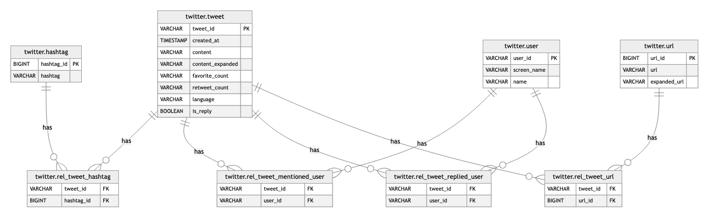

# analyze-twitter-export
Analyze your Twitter export data with the help of [DuckDB](https://duckdb.org/).

## Usage
The following steps are required to analyze your Twitter export data.

1. Install DuckDB.  
    This can be done with running the `scripts/install_duckdb.sh` script (it assumes you're on a Linux machine). Otherwise you could do a `brew install duckdb` on MacOS, or follow the [instructions](https://duckdb.org/docs/installation) for your platform from the DuckDB website.
2. Copy the downloaded Twitter export data to the `src-data` directory.  
    This should be the zip file you downloaded from Twitter.
3. Prepare the Twitter export data for import into DuckDB.  
    The data needs to be converted into a format that can be imported into DuckDB. This can be done with running the `scripts/tweets.sh` script.
4. Create a DuckDB database from your Twitter export data.  
    This can be done with running the `scripts/create_database.sh` script. The result will be a file called `twitter.duckdb` in the `data` directory.
5. Analyze the data.  
    This can be done with running `duckdb data/twitter.duckdb` in the project root directory, and then executing the SQL queries inside the started DuckDB CLI.
 
## Entity Relationship Diagram
The following diagram shows the structure of the resulting database.

